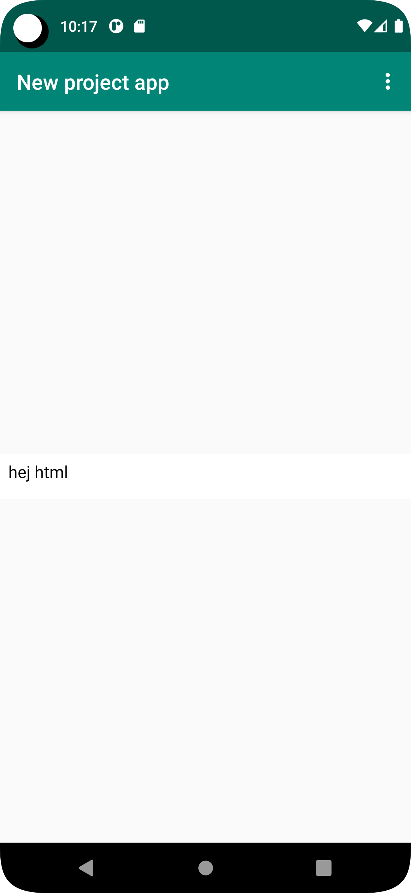
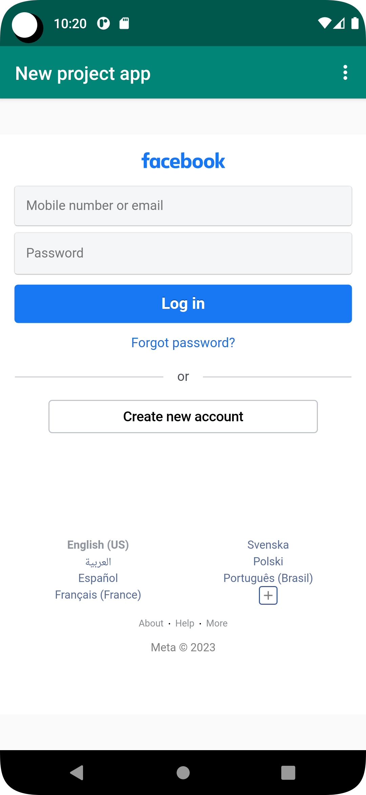

# Rapport

**Skriv din rapport här!**

Appen ändrades namnet till specifik namn "New project app", aktiverat internetåtkomst för appen
genom att lägga till denna rad kod "<uses-permission android:name="android.permission.INTERNET" />".
Dessutom en webb skapats i layout file och ändarade namnet till WebView1 (android:id="@+id/WebView1")
Därefter skapat id som WebView1 och lokaliserat under onCreate method
(myWebView = (WebView) findViewById(R.id.WebView1);)
WebViewClient skapat för att klienten kunna läsa hemsidan och aktiverat även java 
för att hemsidan ska funka. Html page lagts till och sparat in en text i (<p>hej html</p>)
Sist har implementerats både external och internal webpage
myWebView.loadUrl("https://www.facebook.com/");
myWebView.loadUrl("file:///android_asset/App.html");

```
<resources>
//här skrevs projekt namnet
    <string name="app_name">New project app</string>
</resources>
   ```


 ```
 <WebView
 // skapat id
        android:id="@+id/WebView1"
       />
        ```
        
        
    ```
       //decklarerat
  private WebView myWebView; 
  
  //External och internal webpage
  public void showExternalWebPage(){
        myWebView.loadUrl("https://www.facebook.com/");
    }
    public void showInternalWebPage(){
        myWebView.loadUrl("file:///android_asset/App.html");
    }   
    ```
    
    
  ```
    //Lokaliserat id
    myWebView = (WebView) findViewById(R.id.WebView1);
    //skapat webclient
        myWebView.setWebViewClient(new WebViewClient());
        //javascript
        WebSettings webSettings = myWebView.getSettings();
        webSettings.setJavaScriptEnabled(true);
    ```

```
    
        //ropat methoden 
         showExternalWebPage();
         showInternalWebPage();
    ```
    
   ```       
         //Lagt till html page som asset
         <html>
        <body>
        <p>hej html</p>
        </body>
        </html>
    ```
 






